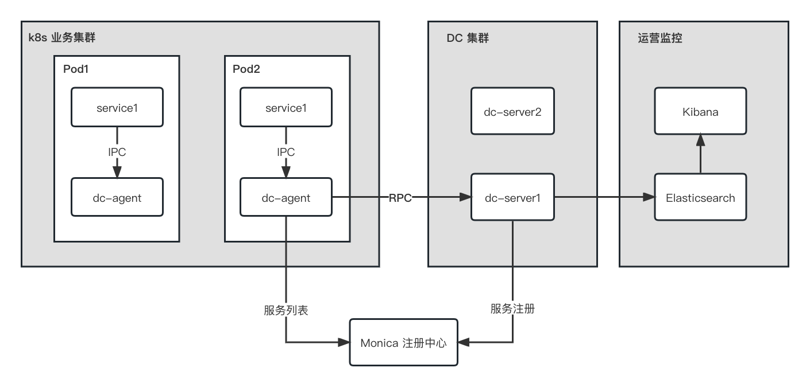

## gRPC Data Collector

**gRPC Data Collector** 服务集群用于接收业务上报的全链路数据.



### Running

服务集成在一个二进制文件中，支持两种启动模式：

```shell
# 服务编译
go build -o grpc-datacollector

# 启动 Agent 模式（暂时不支持）
grpc-datacollector agent

# 启动 Server 模式
grpc-datacollector server
```

在服务启动前，请先确保下列依赖服务已经在本地安装且可以正常访问：

- Elasticsearch-7.17.8
- Kibana-7.17.8
- [Monica 服务注册中心](https://github.com/ZuoFuhong/monica)


### Kibana 数据可视化

注意：Elasticsearch 和 Kibana 的版本需要对应

**1.创建索引**

```shell
curl --location --request PUT 'http://127.0.0.1:9200/grpc_tracing' \
--header 'Content-Type: application/json' \
--data '{
  "mappings": {
    "properties": {
      "trace_id": {
        "type": "keyword"
      },
      "cmd": {
        "type": "keyword"
      },
      "project": {
        "type": "keyword"
      },
      "source": {
        "type": "keyword"
      },
      "server_ip": {
        "type": "keyword"
      },
      "errcode": {
        "type": "integer"
      },
      "errmsg": {
        "type": "keyword"
      },
      "timestamp": {
        "type": "long"
      },
      "timecost": {
        "type": "integer"
      },
      "reqbody": {
        "type": "keyword"
      },
      "span_id": {
        "type": "integer"
      },
      "patent_span_id": {
        "type": "integer"
      },
      "@timestamp": {
        "type": "date"
      }
    }
  },
  "settings": {
    "index": {
      "number_of_shards": 1,
      "number_of_replicas": 0
    }
  }
}'
```

**2.添加记录**

```shell
curl --location --request POST 'http://127.0.0.1:9200/grpc_tracing/_doc' \
--header 'Content-Type: application/json' \
--data '{
  "trace_id": "2ef9e9d0-82ff-4bbf-b205-5df5335aa5f1",
  "cmd": "ImportWallet",
  "project": "go_wallet_manage_svr",
  "source": "grpc_gateway_best_practices",
  "server_ip": "127.0.0.1",
  "errcode": 50000,
  "errmsg": "系统请求错误，请稍后重试",
  "timestamp": 1671358211,
  "timecost": 150,
  "reqbody": "{\"private_key\":\"0x01c4bda0939df07a31e3738c6c1e1d5905c9f229e6ffa1922557308a62efb23f\"}",
  "span_id": 2,
  "patent_span_id": 1,
  "@timestamp": "2022-12-18T22:30:55+08:00"
}'
```

**3.搜索记录**

```shell
curl --location --request POST 'http://127.0.0.1:9200/grpc_tracing/_search' \
--header 'Content-Type: application/json' \
--data '{
  "query": {
    "match": {
      "cmd": "ImportWallet"
    }
  },
  "from": 0,
  "size": 10
}'
```

### License

This project is licensed under the [Apache 2.0 license](https://github.com/ZuoFuhong/grpc-datacollector/blob/master/LICENSE).